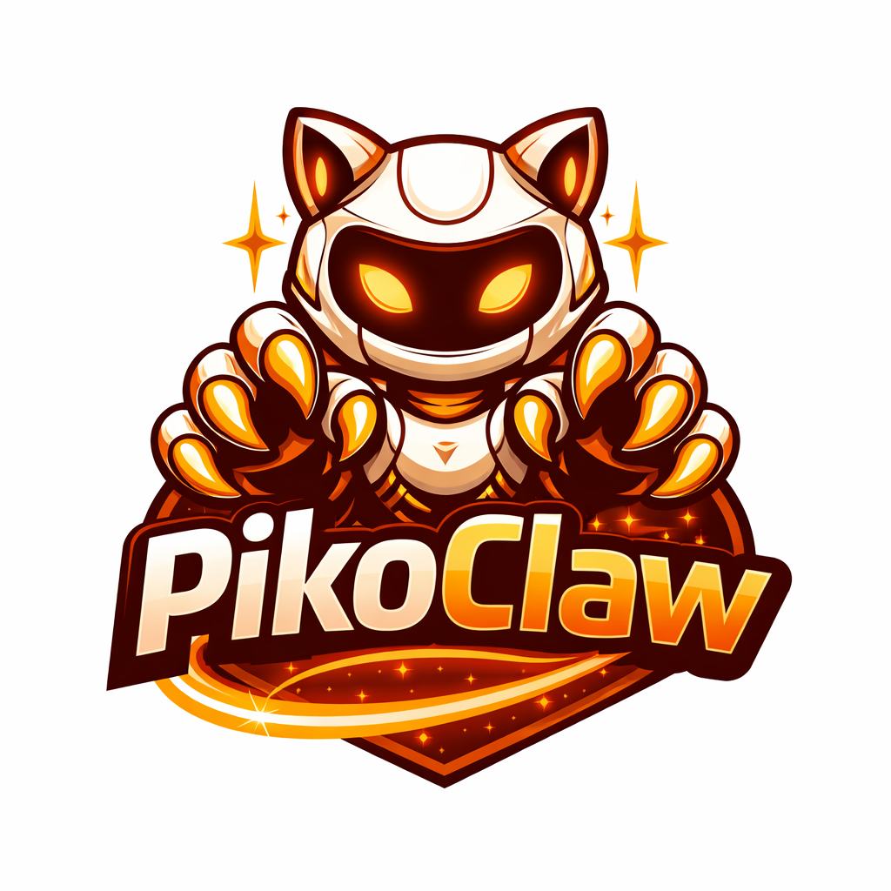
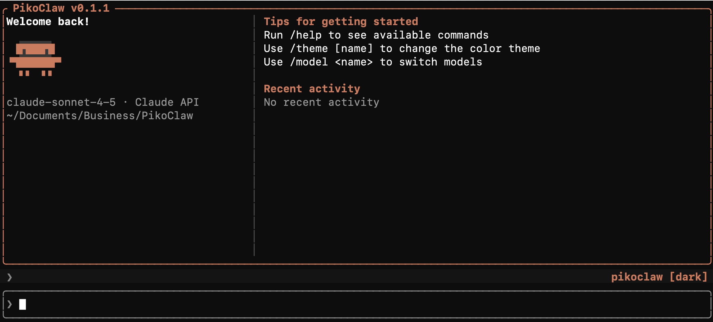
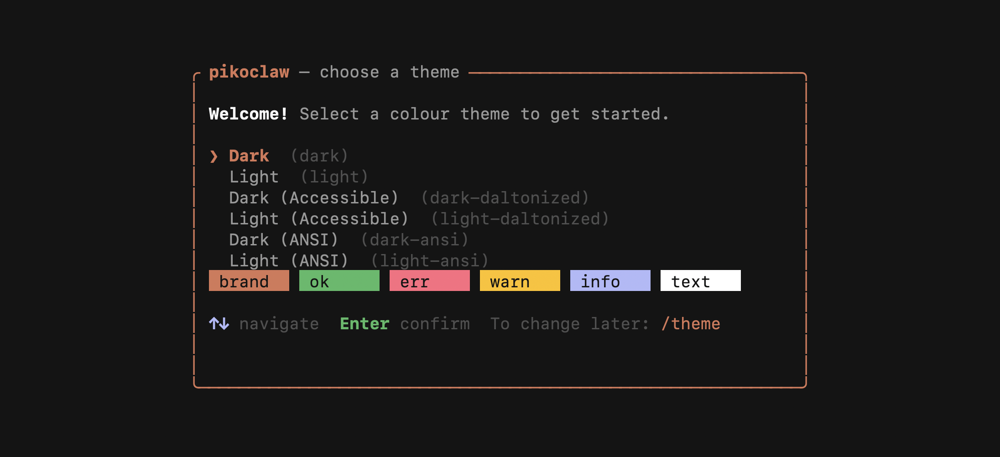
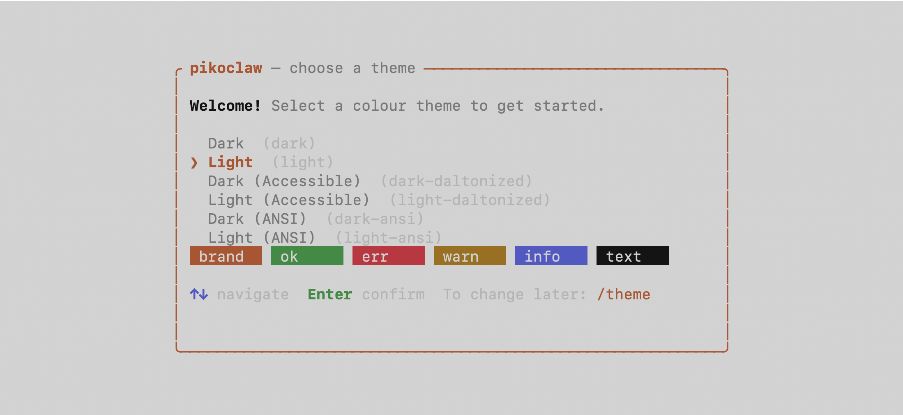
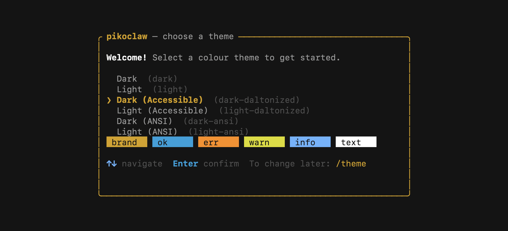
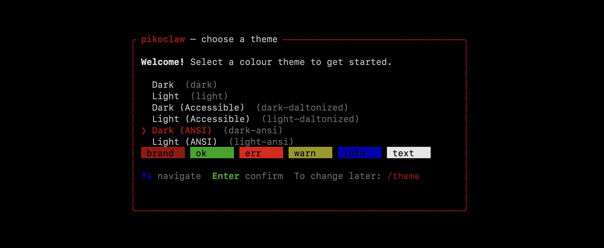
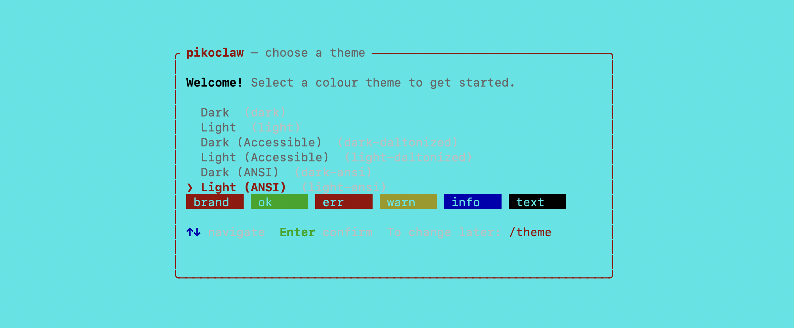

<div align="center">

# PikoClaw



[](LICENSE)
[](https://github.com/PikoClaw/pikoclaw/actions/workflows/release.yml)
[](https://www.rust-lang.org)
[](#install)
[](#)
[](#)


</div>

The Open Source High-performance AI agent for developers, written in Rust. Inspired from Claude Code leak ; )

Ultra lightweight (~6-7 MB) and blazing fast. All LLMs are Supported i.e. `Anthropic`, `OpenAI`, `OpenRouter.ai` etc

Run `/connect` command to connect to AI Provider of your choice! 

## Origin: The Claude Code Source Leak

On March 31, 2026, Chaofan Shou discovered that Anthropic accidentally shipped the **entire Claude Code source** in a `.map` sourcemap file bundled into the npm package — exposing every file, comment, internal constant, and system prompt to anyone who ran `npm pack`.

PikoClaw was born from a deep-dive into that leaked source. The feature specs and design specs in our docs are derived directly from that research.

- **Derived feature specs**: [`pikoclaw.com/docs/spec/`](https://pikoclaw.com/docs/spec/)
- **Derived design specs**: [`pikoclaw.com/docs/design-spec/`](https://pikoclaw.com/docs/design-spec/)

## Interface



## Themes

| Dark | Light |
|---|---|
|  |  |
|  |  |
|  |  |

Switch themes with `/theme [name]` — available names: `dark`, `light`, `dark-daltonized`, `light-daltonized`, `dark-ansi`, `light-ansi`.

## Install

You can also go to the [latest GitHub Release](https://github.com/PikoClaw/PikoClaw/releases) and download the appropriate binary for your platform.

### macOS

```bash
brew tap PikoClaw/pikoclaw
brew install pikoclaw
```

**Upgrade PikoClaw**

```bash
brew upgrade pikoclaw

# If not working, then follow:
brew uninstall pikoclaw
brew untap pikoclaw/pikoclaw
brew tap pikoclaw/pikoclaw
brew install pikoclaw
```

### Linux

```bash
curl -L https://github.com/PikoClaw/PikoClaw/releases/latest/download/pikoclaw-linux-x86_64 -o pikoclaw
chmod +x pikoclaw
sudo mv pikoclaw /usr/local/bin/
```

### Windows

Download `pikoclaw-windows-x86_64.exe` from the [latest GitHub Release](https://github.com/PikoClaw/PikoClaw/releases) and either:

**Option A — add to PATH permanently:**
```powershell
Move-Item pikoclaw-windows-x86_64.exe "$env:USERPROFILE\bin\pikoclaw.exe"
# Add %USERPROFILE%\bin to your PATH if not already there
```

**Option B — run directly:**
```powershell
.\pikoclaw-windows-x86_64.exe
```

## Usage

```bash
pikoclaw

pikoclaw --print "explain this codebase"

pikoclaw continue

pikoclaw resume <session-id>

pikoclaw --model sonnet
pikoclaw --model opus
pikoclaw --model haiku

pikoclaw --dangerously-skip-permissions
```

## Configuration

Config file: `~/.config/pikoclaw/config.toml`

```toml
[api]
model = "claude-sonnet-4-5"
max_tokens = 8192

[permissions]
bash = "ask"
file_write = "ask"
file_read = "allow"
web_fetch = "ask"

[[permissions.rules]]
tool = "bash"
pattern = "rm -rf *"
decision = "deny"
```

### Standard Anthropic API

```bash
export ANTHROPIC_API_KEY="sk-ant-..."
```

### Third-party providers (OpenRouter, etc.)

PikoClaw supports any provider that exposes an Anthropic-compatible API via Bearer-token auth — no `ANTHROPIC_API_KEY` required.

Add these to `~/.zshrc` or `~/.bashrc`:

```bash
export OPENROUTER_API_KEY="sk-or-v1-..."
export ANTHROPIC_BASE_URL="https://openrouter.ai/api"
export ANTHROPIC_AUTH_TOKEN="$OPENROUTER_API_KEY"

# Set the model ID from your chosen provider
export ANTHROPIC_DEFAULT_SONNET_MODEL="stepfun/step-3.5-flash:free"
```

> **Credential priority:** `ANTHROPIC_AUTH_TOKEN` (Bearer) takes precedence over `ANTHROPIC_API_KEY` (x-api-key) when both are set.

### Environment variable reference

| Variable | Description |
|---|---|
| `ANTHROPIC_API_KEY` | Standard Anthropic API key (`x-api-key` header) |
| `ANTHROPIC_AUTH_TOKEN` | Bearer token for third-party providers (e.g. OpenRouter). Takes priority over `ANTHROPIC_API_KEY`. |
| `ANTHROPIC_BASE_URL` | Override the API base URL (default: `https://api.anthropic.com`) |
| `ANTHROPIC_DEFAULT_SONNET_MODEL` | Override the default model (e.g. `qwen/qwen3.6-plus:free`) |
| `ANTHROPIC_MODEL` | Alternative model override (lower priority than `ANTHROPIC_DEFAULT_SONNET_MODEL`) |
| `PIKOCLAW_CONFIG` | Override the config file path |

## Built-in Tools

| Tool | Description |
|---|---|
| `Bash` | Run shell commands |
| `Read` | Read files with line numbers |
| `Write` | Write files |
| `Edit` | Exact string replacement in files |
| `Glob` | Find files by pattern |
| `Grep` | Search file contents with regex |
| `WebFetch` | Fetch and extract text from URLs |
| `WebSearch` | Web search via Anthropic beta |
| `NotebookEdit` | Edit Jupyter notebook cells |
| `TodoWrite` | In-session task checklist |
| `AskUserQuestion` | Ask the user multiple-choice questions |
| `Agent` | Spawn isolated sub-agents |

## Slash Commands

| Command | Description |
|---|---|
| `/help` | List available commands |
| `/clear` | Clear conversation history |
| `/model <name>` | Switch model mid-session (`sonnet`, `opus`, `haiku`) |
| `/theme [name]` | Cycle themes or set by name |
| `/compact` | Summarize history to reduce token usage |
| `/exit` | Exit |

Custom skills can be added as Markdown files in `~/.config/pikoclaw/skills/`.

## Building

```bash
cargo build --release
```

Requires Rust 1.80+.

## Architecture

Cargo workspace with 10 crates:

```
crates/
  piko-types        # Core domain types
  piko-config       # Config file and env var loading
  piko-api          # Anthropic API client with SSE streaming
  piko-tools        # Tool trait and built-in tool implementations
  piko-permissions  # Permission policy engine
  piko-session      # Session persistence and resume
  piko-agent        # Core agent loop and orchestration
  piko-mcp          # Model Context Protocol client
  piko-tui          # ratatui interactive terminal UI
  piko-skills       # Slash command registry and dispatcher
```

## Creating New Release

```
cd PikoClaw
git tag v0.1.0
git push origin v0.1.0
```

The release.yml workflow will:

1. Build binaries for macOS arm64, macOS x86_64, Linux x86_64, and Windows x86_64
2. Create the GitHub release and upload the binaries
3. Automatically update the SHA256 hashes in homebrew-pikoclaw/Formula/pikoclaw.rb and push it
